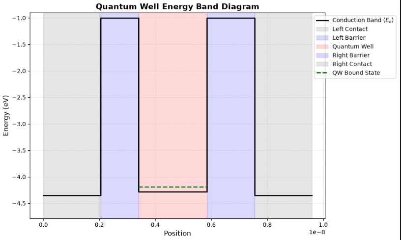
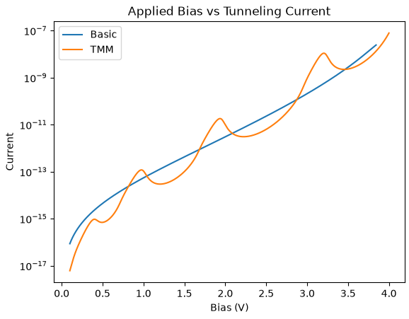
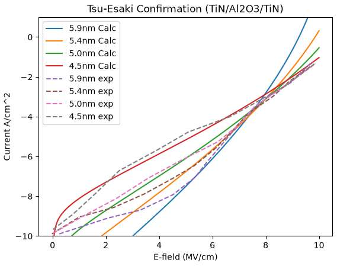

# Quantum Tunneling Current Calculator

This repository contains a modular Python suite designed to calculate quantum tunneling currents and transmission probabilities across various semiconductor and 2D material heterostructures. 

It provides tools to model single barriers, basic quantum wells, and complex asymmetric structures using both standard analytical approximations and the Transfer Matrix Method (TMM).

## Project Gallery

Here are some snapshots of the outputs of my code:

### Band Diagram Visualizer


### Current through a Quantum Well


### Experimental vs Theoretical Tunneling Current through a Barrier


## Features

*   **Tsu-Esaki Modeling:** Calculate tunneling currents by integrating over the supply function and Fermi-Dirac distributions. 
*   **Experimental Benchmarking:** Includes pre-configured confirmation scripts comparing theoretical Tsu-Esaki calculations against experimental data for TiN/Al2O3/TiN and Graphene/h-BN/Graphene junctions.
*   **Transfer Matrix Method (TMM):** A robust TMM solver capable of determining the transmission probability spectrum for generalized, asymmetric structures while accounting for different effective masses in each respective region.
*   **Comprehensive Materials Library:** Built-in physical constants and extensive material parameters (including dielectric constants, effective masses, electron affinities, and monolayer thicknesses) for materials such as Al2O3, h-BN, WSe2, MoS2, Graphene, and ITO.
*   **Visualization Suite:** Built-in Matplotlib functions to generate step-like conduction band energy diagrams and plot current-voltage (I-V) or bias-probability relationships.

## Repository Structure

The code is organized into a custom library (`my_libs`) to keep physics calculations separate from integrations and plotting. 

| Module | Description |
| :--- | :--- |
| `Constants.py` | Contains fundamental natural constants and material-specific modifiers (e.g., bandgaps, electron affinities). |
| `Quantum_Core.py` | Core quantum mechanical functions for calculating electron velocities, k-vectors, barrier decay constants, and single-barrier elastic tunneling probabilities. |
| `Probs.py` | Computes generalized transmission probabilities for both basic barriers and quantum well structures. |
| `TMM.py` | Implements the Transfer Matrix Method using complex arrays to handle differing effective masses across boundaries. |
| `T_E.py` | Handles the numerical integration (`scipy.integrate.quad`) of the Tsu-Esaki model to yield total tunneling current densities. |
| `Visualizations.py` | Plotting utilities for visualizing tunneling probabilities, current scaling, and conduction band profiles. |

## Mathematical Background

### Transfer Matrix Method (TMM)
The TMM implementation in this repository goes beyond constant-mass simplifications. It constructs a $2 \times 2$ generalized interface matrix that enforces the continuity of both the wavefunction $\psi$ and its derivative weighted by the effective mass $\frac{1}{m^*} \frac{d\psi}{dx}$. 

For an interface between region 1 and region 2, the generalized matrix elements depend on the momentum and mass ratios:
$$K = \frac{m_1^* k_2}{k_1 m_2^*}$$

The total transmission probability $T$ is then calculated using the transmitted and incident flux, taking into account the effective mass of the incident and outgoing regions:
$$T = \vert{}t_{amp}\vert{}^2 \frac{k_{out} / m_{out}^*}{k_{in} / m_{in}^*}$$

### Current Integration
Total tunneling current is derived via the Tsu-Esaki formula by integrating the product of the transmission probability and the supply function over a specified energy range defined by `E_LOW` and `E_HIGH`.

## Requirements

The project relies on standard scientific Python libraries. Ensure you have the following installed:
*   `numpy`
*   `scipy`
*   `matplotlib`

## Usage Example

To plot the conduction band energy diagram of a quantum well structure, you can pass a dictionary of your structural parameters into the visualization module:

```python
import matplotlib.pyplot as plt
from my_libs import Visualizations as vis
from my_libs import Constants as const

q = const.q

# Define the physical parameters of the quantum well
params = {
    "lBar_Thickness": 5e-9,
    "rBar_Thickness": 5e-9,
    "QW_Length": 2e-9,
    "EA_Cond": 4.45 * q,
    "EA_lBarrier": const.EA_Al2O3,
    "EA_rBarrier": const.EA_Al2O3,
    "QW_EA": 4.0 * q,
    "QW_Energy": 0.1 * q
}

# Generate the energy band diagram
vis.plot_quantum_well(params)
```

## Mathematical References

1. Tsu-Esaki Model: https://www.iue.tuwien.ac.at/phd/gehring/node36.html

## Comparison Papers
1. Shuang Meng, C. Basceri, B. W. Busch, G. Derderian, G. Sandhu; Leakage mechanisms and dielectric properties of Al2O3 / TiN-based metal-insulator-metal capacitors. Appl. Phys. Lett. 24 November 2003; 83 (21): 4429–4431. https://doi.org/10.1063/1.1629373

2. Liam Britnell, Roman V. Gorbachev, Rashid Jalil, Branson D. Belle, Fred Schedin, Mikhail I. Katsnelson, Laurence Eaves, Sergey V. Morozov, Alexander S. Mayorov, Nuno M. R. Peres, Antonio H. Castro Neto, Jon Leist, Andre K. Geim, Leonid A. Ponomarenko, Kostya S. Novoselov; Electron Tunneling through Ultrathin Boron Nitride Crystalline Barriers. Nano Lett. 14 March 2012; 12 (3): 1707–1710. https://doi.org/10.1021/nl3002205

## 📝 License

This project is licensed under the [MIT License](License.txt) - see the LICENSE file for details.